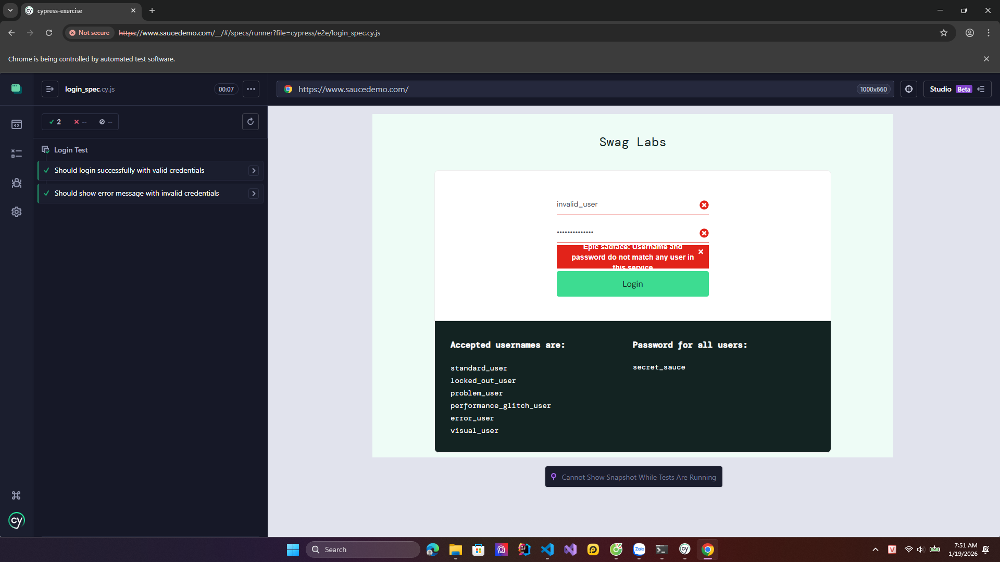
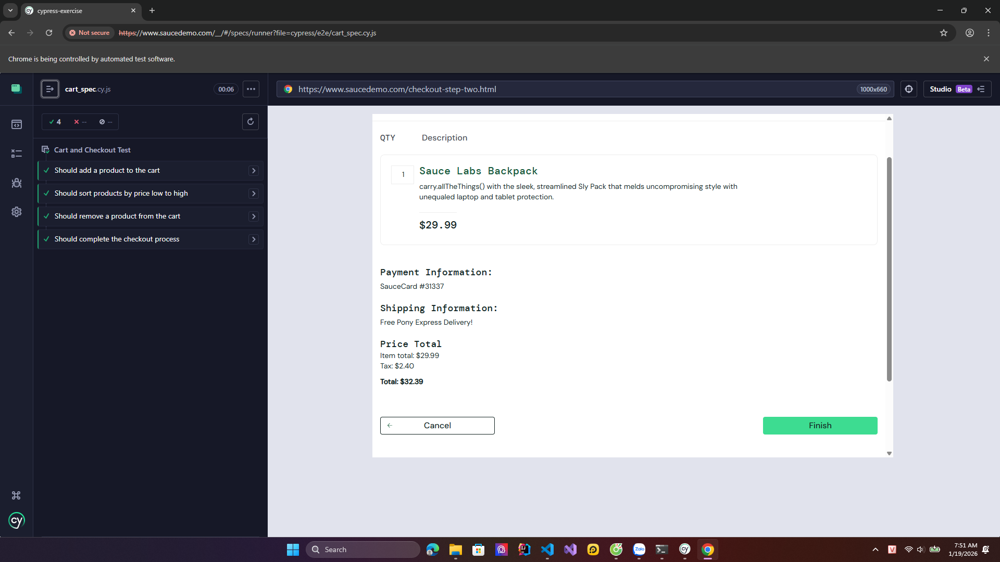
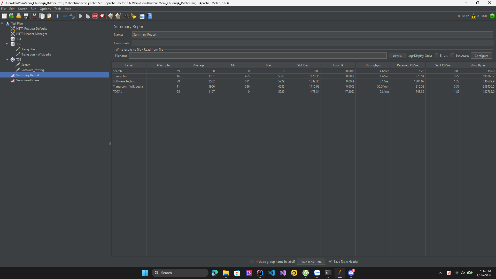
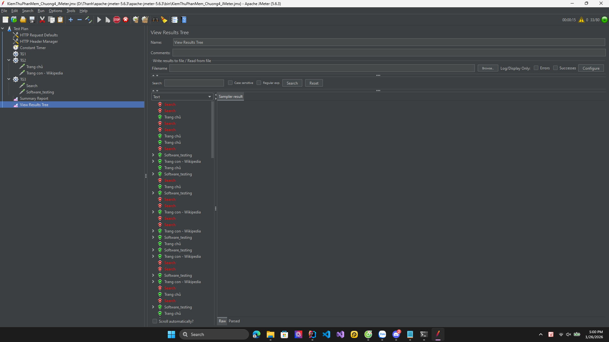

## BÀI THỰC HÀNH KIỂM THỬ PHẦN MỀM

### Thông tin sinh viên

* **Họ và tên:** Đào Quang Thành
* **MSSV:** BIT230384
* **Email:** daoquangthanh0704@gmail.com
* **Môn học:** Kiểm thử phần mềm
* **Giảng viên:** Trương Anh Hoàng

---

## PHẦN 1 – BÀI THỰC HÀNH TUẦN 1: TRẢI NGHIỆM KIỂM THỬ GIAO DIỆN

### Mục tiêu bài thực hành

* Làm quen với GitHub và cách quản lý bài thực hành bằng kho lưu trữ (repository).
* Trải nghiệm và đánh giá chất lượng giao diện phần mềm.
* Nhận thức được vai trò của trải nghiệm người dùng (UX/UI) trong kiểm thử phần mềm.

### Nội dung thực hành

#### Trải nghiệm kiểm thử giao diện với CantUnsee

* Truy cập trang web: [https://cantunsee.space/](https://cantunsee.space/)
* Thực hiện các bài kiểm tra về:

  * Khả năng phân biệt màu sắc.
  * Khả năng nhận diện và đọc hiểu các thành phần giao diện người dùng.

### Minh chứng kết quả

* Ảnh chụp màn hình kết quả làm bài trên Can't Unsee.
* Ảnh có dấu hiệu cá nhân (ví dụ: đang đăng nhập Chrome) để chứng minh tính xác thực.

**Hình ảnh minh chứng:**


## PHẦN 2 – BÀI THỰC HÀNH TUẦN 2: KIỂM THỬ ĐƠN VỊ VỚI JUNIT

### Tên bài tập

**Phân tích điểm số học sinh (Student Analyzer)**

### Mô tả bài tập

Dự án này là bài tập thực hành về Kiểm thử phần mềm (Software Testing), tập trung vào việc viết **kiểm thử đơn vị** cho mã nguồn Java bằng thư viện **JUnit**.

Chương trình cung cấp lớp `StudentAnalyzer` để xử lý danh sách điểm số của học sinh với các chức năng chính:

#### 1. Đếm số học sinh giỏi

* **Input:** Danh sách điểm số (List)
* **Logic:** Đếm các điểm >= 8.0. Bỏ qua các điểm không hợp lệ (nhỏ hơn 0 hoặc lớn hơn 10)
* **Output:** Số lượng học sinh giỏi

#### 2. Tính điểm trung bình hợp lệ

* **Input:** Danh sách điểm số (List)
* **Logic:** Tính trung bình cộng các điểm nằm trong khoảng [0, 10]. Bỏ qua các điểm sai
* **Output:** Điểm trung bình (trả về 0 nếu danh sách rỗng hoặc không có điểm hợp lệ)


### Cấu trúc thư mục dự án

```
unit-test/
├── src/
│   └── StudentAnalyzer.java      # Mã nguồn chính (Source code)
├── test/
│   └── StudentAnalyzerTest.java  # Mã nguồn kiểm thử (Unit Tests)
├── README.md                     # Tài liệu hướng dẫn
```
## PHẦN 3 – BÀI THỰC HÀNH TUẦN 3: KIỂM THỬ TỰ ĐỘNG END-TO-END VỚI CYPRESS

### Mục tiêu bài thực hành

* Cài đặt và cấu hình môi trường kiểm thử tự động với **Cypress**.
* Hiểu và thực hành viết kịch bản kiểm thử End-to-End (E2E).
* Thực hiện kiểm thử trên trang web mẫu: [https://www.saucedemo.com](https://www.saucedemo.com).

### Mô tả bài tập

Viết mã kiểm thử tự động cho quy trình mua hàng trên trang web giả lập cửa hàng trực tuyến SauceDemo. Bài tập bao gồm các kịch bản cơ bản (đăng nhập, thêm giỏ hàng) và các kịch bản nâng cao (xóa sản phẩm, quy trình thanh toán).

### Các kịch bản kiểm thử (Test Scenarios)

Đã thực hiện 2 tệp kiểm thử chính nằm trong thư mục `cypress/e2e/`:

#### 1. Kiểm thử Đăng nhập (`login_spec.cy.js`)

* **Test Case 1:** Đăng nhập thành công với tài khoản hợp lệ (`standard_user`).
* **Test Case 2:** Kiểm tra hiển thị thông báo lỗi khi nhập sai tài khoản/mật khẩu.

#### 2. Kiểm thử Giỏ hàng & Thanh toán (`cart_spec.cy.js`)

* **Test Case 3:** Thêm sản phẩm vào giỏ hàng và kiểm tra số lượng hiển thị (Badge = 1).
* **Test Case 4:** Kiểm tra chức năng lọc/sắp xếp sản phẩm theo giá (Low to High).
* **Test Case 5 (Yêu cầu thêm):** Kiểm tra chức năng xóa sản phẩm khỏi giỏ hàng (Sau khi xóa, Badge biến mất).
* **Test Case 6 (Yêu cầu thêm):** Kiểm tra toàn bộ quy trình thanh toán (Checkout: Điền thông tin -> Continue -> Finish).

### Minh chứng kết quả
* **Kết quả kiểm thử Đăng nhập (Login Spec):**


* **Kết quả kiểm thử Giỏ hàng (Cart Spec):**


## PHẦN 4: BÀI THỰC HÀNH TUẦN 4: KIỂM THỬ HIỆU NĂNG VỚI JMETER

### Mục tiêu bài tập
Thực hiện kiểm thử hiệu năng website Wikipedia để đánh giá các chỉ số Average Response Time, Error Rate và Throughput.

### Kết quả kiểm thử (Summary Report)

Đây là số liệu thực tế thu được từ công cụ JMeter:
| Label | # Samples | Average (ms) | Error % | Throughput |
| :--- | :--- | :--- | :--- | :--- |
| **Trang chủ** | 16 | 1751 | 0.00% | 1.4/sec |
| **Software_testing** | 39 | 2582 | 0.00% | 3.1/sec |
| **Search (Lỗi)** | 59 | 0 | 100.00% | 4.6/sec |
| **TOTAL** | **125** | **1197** | **47.20%** | **9.8/sec** |


### Phân tích lỗi 403 Forbidden
Trong quá trình thực hiện, yêu cầu tìm kiếm (Search) bị lỗi 100% với mã phản hồi **403 Forbidden**. 

**Nguyên nhân:** Wikipedia phát hiện truy cập tự động từ công cụ và kích hoạt cơ chế bảo vệ để tránh quá tải hệ thống (Rate Limiting). Em đã khắc phục một phần bằng cách thêm **User-Agent** trong **HTTP Header Manager** để giả lập trình duyệt, giúp các trang nội dung tĩnh chạy thành công.

### Minh chứng hình ảnh



